<div align="center">
  
  
  # 🔍 MCPower
  
  ### *Semantic Knowledge Search, Simplified*
  
  **Transform your documents into searchable knowledge bases with FAISS vector embeddings**
  
  [](https://www.typescriptlang.org/)
  [](https://nodejs.org/)
  [](https://www.python.org/)
  [](tests/)
  [](LICENSE)
  
  [🚀 Quick Start](#-quick-start) • [📚 Documentation](QUICKSTART.md) • [🐛 Report Bug](https://github.com/wspotter/mcpower/issues) • [💡 Request Feature](https://github.com/wspotter/mcpower/issues)
  
  ---
  
</div>

## ✨ What is MCPower?

MCPower is a **Model Context Protocol (MCP) server** that provides powerful semantic search over your document collections. Drop in any folder of `.txt` or `.md` files, and get instant AI-powered search capabilities through a beautiful web interface or programmatic API.

**Perfect for:**
- 📚 Documentation sites
- 🗂️ Knowledge bases
- 💬 Chatbot context
- 🔍 Research papers
- 📝 Note collections

---

## 🎯 Features at a Glance

<table>
<tr>
<td width="50%">

### 🖱️ **Drag & Drop Interface**
Just drop folders into the web console to create searchable datasets. No CLI commands needed!

### ⚡ **Lightning Fast**
FAISS-powered vector search with <500ms response times. Search thousands of documents instantly.

### 🧠 **Semantic Understanding**
Uses sentence transformers for intelligent matching beyond keyword search.

</td>
<td width="50%">

### 🔌 **MCP Compatible**
Works with Claude Desktop, VS Code, Cherry Studio, and any MCP client.

### 📦 **Zero Config**
One-click launcher automatically sets up everything. Just run `./launch.sh`.

### 🎨 **Beautiful UI**
Modern, responsive web console with real-time stats and visual feedback.

</td>
</tr>
</table>

---

---

## 🚀 Quick Start

<details open>
<summary><b>🐧 Linux / 🍎 macOS</b></summary>

```bash
# Clone the repository
git clone https://github.com/wspotter/mcpower.git
cd mcpower

# Run the launcher - it does everything!
./launch.sh
```

The web console opens automatically at **http://127.0.0.1:4173** 🎉

</details>

<details>
<summary><b>🪟 Windows</b></summary>

```bash
# Clone the repository
git clone https://github.com/wspotter/mcpower.git
cd mcpower

# Double-click launch.bat or run:
launch.bat
```

Your browser opens automatically to **http://127.0.0.1:4173** 🎉

</details>

### 📸 What You'll See

<div align="center">
  
  <p><i>Drag & drop folders, browse for directories, or type paths manually</i></p>
</div>

---

## ✨ Features

- **Semantic Search**: Search knowledge datasets using natural language queries
- **Interactive Web Console**: Manage datasets with drag-and-drop interface
- **Multiple Datasets**: Manage and search across multiple knowledge bases
- **MCP Compatible**: Works with any MCP client (VS Code, Cherry Studio, etc.)
- **Fast & Reliable**: FAISS-powered vector search with <500ms p95 latency
- **Graceful Degradation**: Continues working even with invalid datasets
- **Comprehensive Logging**: Structured JSON logs with detailed diagnostics

---

## 🏗️ How It Works

```mermaid
graph TD
    A[📄 Your Documents] -->|Python Indexer| B[🧮 Embeddings]
    B -->|FAISS| C[💾 Vector Database]
    C -->|TypeScript MCP Server| D[🔌 MCP Protocol]
    D --> E1[VS Code Copilot]
    D --> E2[Cherry Studio]
    D --> E3[Any MCP Client]
    
    style A fill:#e3f2fd
    style B fill:#fff3e0
    style C fill:#f3e5f5
    style D fill:#e8f5e9
    style E1 fill:#fce4ec
    style E2 fill:#fce4ec
    style E3 fill:#fce4ec
```

<div align="center">



</div>

### The Magic Behind MCPower

1. **📚 Document Processing**
   - Python reads your documents (txt, md, pdf)
   - Splits them into semantic chunks
   - Generates embeddings using `sentence-transformers`

2. **⚡ Fast Vector Search**
   - FAISS indexes embeddings for lightning-fast similarity search
   - Sub-500ms query latency even on large datasets
   - Efficient memory usage with optimized index structures

3. **🔌 MCP Integration**
   - TypeScript server exposes MCP tools
   - Clients send queries via stdio protocol
   - Python bridge handles FAISS operations
   - Results returned as JSON with relevance scores

---

## ⚙️ Installation

### Prerequisites

- **Node.js** 18+ and npm
- **Python** 3.10+
- **Git**

### Automatic Setup (Recommended)

```bash
git clone https://github.com/wspotter/mcpower.git
cd mcpower
./launch.sh  # Does everything automatically!
```

The launcher will:
- ✅ Create virtual environment
- ✅ Install Python dependencies
- ✅ Install Node.js dependencies
- ✅ Configure environment variables
- ✅ Start the web console
- ✅ Open your browser

### Manual Setup

<details>
<summary><b>Click to expand manual installation steps</b></summary>

**1. Clone the repository**
```bash
git clone https://github.com/wspotter/mcpower.git
cd mcpower
```

**2. Install Node.js dependencies**
```bash
npm install
```

**3. Create Python virtual environment**
```bash
python3 -m venv .venv
```

**4. Install Python dependencies**
```bash
.venv/bin/pip install typer faiss-cpu sentence-transformers
```

**5. Configure environment**
```bash
cat > .env << EOF
MCPOWER_PYTHON=$(pwd)/.venv/bin/python
EOF
```

**6. Build and run**
```bash
npm run build
npm run dev -- --datasets ./datasets
```

</details>

---
│  └─────┬─────┘  │
└────────┼────────┘
         │ execa (JSON over stdio)
         │
┌────────┴────────┐
│ Python Bridge   │
│   (Python)      │
│                 │
│  ┌───────────┐  │
│  │   FAISS   │  │  Vector search
│  │   Index   │  │  
│  └───────────┘  │
│                 │
│  ┌───────────┐  │
│  │ Sentence  │  │  Query encoding
│  │Transformers│  │  
│  └───────────┘  │
└─────────────────┘
```

## 📦 Installation

### Prerequisites

- **Node.js**: 18.x or higher
- **Python**: 3.10 or higher
- **npm**: 9.x or higher

### From Source

```bash
# Clone the repository
git clone https://github.com/yourusername/mcpower.git
cd mcpower

# Install dependencies
npm install
cd python && pip install -r requirements.txt && cd ..

# Build
npm run build

# Optional: Link globally
npm link
```

### Verify Installation

```bash
npm run dev -- --version
# Output: Starting MCP Knowledge Server v0.1.0...
```

## ⚙️ Configuration

### Command Line Options

```bash
npm run dev -- [options]
```

Options:
- `--datasets <path>`: Path to datasets directory (default: `./datasets`)
- `--log-level <level>`: Log level: debug, info, warn, error (default: `info`)
- `--version`: Show version information

### Environment Variables

Create a `.env` file in the project root:

```env
# Datasets directory path
DATASETS_PATH=./datasets

# Log level (debug, info, warn, error)
LOG_LEVEL=info
```

## 📚 Dataset Management

### Using the Web Console

The easiest way to create datasets is through the web console:

1. **Start the console**: `./launch.sh`
2. **Add a dataset**:
   - Click **Browse** to open directory picker
   - Or **drag & drop** a folder into the input field
   - Or **type the path** manually
3. **Submit**: Click "Create Dataset"
4. **Monitor**: Watch real-time indexing progress

### Dataset Structure

Each dataset has three components stored in `datasets/<name>/`:

```
datasets/
└── my-docs/
    ├── config.json        # Dataset configuration
    ├── index.faiss        # FAISS vector index
    └── metadata.json      # Chunk metadata and text
```

### Manual Dataset Creation

<details>
<summary><b>Advanced: Create datasets via Python CLI</b></summary>

```bash
# Index a directory of documents
.venv/bin/python python/src/index.py index \
  --source-path ./my-documents \
  --dataset-name my-docs \
  --output-dir ./datasets/my-docs

# Supported file types: .txt, .md, .pdf
```

**Configuration options:**
```bash
--chunk-size 512         # Characters per chunk
--chunk-overlap 50       # Overlap between chunks
--model sentence-transformers/all-MiniLM-L6-v2
```

</details>

### Dataset Operations

```bash
# List all datasets
GET /api/datasets

# Get dataset details
GET /api/datasets/:name

# Delete dataset
DELETE /api/datasets/:name

# Create dataset (via web console or API)
POST /api/datasets
{
  "name": "my-docs",
  "sourcePath": "/absolute/path/to/documents"
}
```

---
└── your-dataset/
    ├── manifest.json     # Configuration
    ├── metadata.json     # Document metadata
    └── index/           # FAISS index directory
        └── docs.index   # FAISS index file
```

### Manifest Format

`manifest.json`:
```json
{
  "id": "your-dataset",
  "name": "Your Dataset Name",
  "description": "Description of your dataset",
  "index": "index",
  "metadata": "metadata.json",
  "defaultTopK": 5
}
```

### Metadata Format

`metadata.json`:
```json
[
  {
    "id": "doc-1",
    "title": "Document Title",
    "path": "path/to/document.md",
    "content": "Full document content...",
    "snippet": "Short excerpt..."
  }
]
```

### Creating a Dataset

See the [sample dataset](datasets/sample-docs/) for a complete example.

To create embeddings from your documents, use a tool like:
- [sentence-transformers](https://www.sbert.net/)
- FAISS for indexing
- Custom embedding pipeline

## � MCP Integration

MCPower works with any MCP-compatible client. Here's how to connect it:

### VS Code Copilot

Add to your VS Code `settings.json`:

```json
{
  "github.copilot.chat.codeGeneration.instructions": [
    {
      "text": "Use the mcpower MCP server for knowledge search"
    }
  ],
  "mcp.servers": {
    "mcpower": {
      "command": "node",
      "args": ["/absolute/path/to/mcpower/dist/cli.js", "--datasets", "./datasets"],
      "env": {
        "MCPOWER_PYTHON": "/absolute/path/to/mcpower/.venv/bin/python"
      }
    }
  }
}
```

### Cherry Studio

Add to Cherry Studio's MCP configuration:

```json
{
  "mcpServers": {
    "mcpower": {
      "command": "node",
      "args": ["/absolute/path/to/mcpower/dist/cli.js", "--datasets", "./datasets"]
    }
  }
}
```

### Available Tools

#### 🔍 `knowledge.search`

Search your knowledge bases using natural language.

```typescript
{
  dataset: string;     // Dataset name (required)
  query: string;       // Your search query (required)
  topK?: number;       // Number of results (default: 5)
}
```

**Example:**
```json
{
  "tool": "knowledge.search",
  "arguments": {
    "dataset": "my-docs",
    "query": "How do I configure authentication?",
    "topK": 3
  }
}
```

**Response:**
```json
{
  "results": [
    {
      "score": 0.89,
      "title": "Authentication Guide",
      "path": "docs/auth.md",
      "snippet": "To configure authentication, set the AUTH_ENABLED=true..."
    }
  ]
}
```

#### 📋 `knowledge.listDatasets`

List all available datasets.

```typescript
{}  // No parameters
```

**Response:**
```json
{
  "datasets": [
    {
      "id": "my-docs",
      "name": "My Documentation",
      "description": "Internal docs",
      "chunkCount": 1264,
      "defaultTopK": 5
    }
  ],
  "metadata": {
    "total": 1,
    "ready": 1,
    "errors": 0
  }
}
```

---

## 🛠️ Development

### Project Structure

```
mcpower/
├── src/                    # TypeScript MCP server
│   ├── cli.ts             # Entry point
│   ├── server.ts          # MCP protocol handler
│   ├── bridge/            # Python FAISS bridge
│   ├── config/            # Dataset registry
│   ├── store/             # Knowledge store cache
│   └── tools/             # MCP tool implementations
├── python/src/            # Python indexer & search
│   ├── index.py          # CLI for indexing
│   └── search.py         # FAISS search operations
├── webapp/                # Web console
│   ├── index.html        # SPA interface
│   ├── app.js            # Frontend logic
│   └── styles.css        # Styling
├── tests/                 # Test suites
│   ├── unit/             # Unit tests
│   └── integration/      # Integration tests
└── datasets/              # Your knowledge bases
    └── sample-docs/      # Example dataset
```

### Development Scripts

```bash
# Development mode (auto-reload)
npm run dev -- --datasets ./datasets

# Build TypeScript
npm run build

# Start web console
npm run web

# Run tests
npm test

# Run with coverage
npm run test:coverage

# Type checking & linting
npm run lint
```

### Creating a New Tool

1. **Define the tool** in `src/tools/yourTool.ts`:
```typescript
export const yourTool: Tool = {
  name: "knowledge.yourTool",
  description: "What your tool does",
  inputSchema: {
    type: "object",
    properties: {
      param: { type: "string", description: "Parameter description" }
    },
    required: ["param"]
  }
};
```

2. **Implement the handler** in `src/tools/handlers/yourTool.ts`

3. **Register it** in `src/server.ts`

4. **Add tests** in `tests/unit/tools/yourTool.test.ts`

---

## 🧪 Testing

### Quick Test

```bash
# Run all 86 tests
npm test

# Run with coverage report
npm run test:coverage
```

### Test Coverage

✅ **86 tests passing** across:
- 🔍 18 search edge cases (empty queries, special chars, large results)
- 🛠️ 15 search tool validations
- 📚 11 dataset registry operations
- 📋 9 listDatasets tool tests
- 🚀 9 startup integration tests
- 💾 8 knowledge store caching
- ⚡ 6 performance benchmarks (<500ms p95)
- 🔗 5+5 integration tests (search + listDatasets)

### Integration Testing

```bash
# Test with real datasets
./test-search.sh

# Test web console API
./test-web.sh
```

---

## 🐛 Troubleshooting

<details>
<summary><b>❌ Dataset Not Found</b></summary>

**Error**: `Dataset not found: your-dataset`

**Solutions**:
- ✅ Verify dataset exists in `datasets/` directory
- ✅ Check `config.json` has correct name field
- ✅ Restart server to reload dataset registry
- ✅ Use web console to verify dataset list

</details>

<details>
<summary><b>🐍 Python Bridge Failures</b></summary>

**Error**: `Python bridge command failed`

**Solutions**:
- ✅ Verify Python 3.10+ is installed: `python3 --version`
- ✅ Check virtual environment: `.venv/bin/python --version`
- ✅ Reinstall dependencies: `.venv/bin/pip install -r python/requirements.txt`
- ✅ Test FAISS: `.venv/bin/python -c "import faiss; print('OK')"`
- ✅ Check .env file has correct `MCPOWER_PYTHON` path

</details>

<details>
<summary><b>🐌 Slow Search Performance</b></summary>

**Issue**: Queries taking >500ms

**Solutions**:
- ✅ Check dataset size (>10k chunks may need optimization)
- ✅ Verify FAISS index is properly trained
- ✅ Reduce `topK` parameter (try 3-5 instead of 10+)
- ✅ Consider using faster embedding model
- ✅ Use GPU-accelerated FAISS for large datasets

</details>

<details>
<summary><b>🌐 Web Console Connection Issues</b></summary>

**Error**: `ERR_CONNECTION_REFUSED`

**Solutions**:
- ✅ Ensure web server is running: `npm run web`
- ✅ Check port 4173 isn't blocked by firewall
- ✅ Try accessing `http://127.0.0.1:4173` directly
- ✅ Check console logs for startup errors

</details>

<details>
<summary><b>📝 Enable Debug Logging</b></summary>

Get detailed diagnostics:

```bash
npm run dev -- --log-level=debug --datasets ./datasets
```

This shows:
- Dataset loading details
- Python bridge communication
- FAISS index operations
- Search query execution
- Error stack traces

</details>

---

## 🤝 Contributing

We welcome contributions! Here's how to get started:

### Quick Start

```bash
# Fork and clone
git clone https://github.com/YOUR_USERNAME/mcpower.git
cd mcpower

# Create feature branch
git checkout -b feature/amazing-feature

# Install dependencies
npm install
.venv/bin/pip install -r python/requirements.txt

# Make changes and test
npm run build
npm test

# Commit with clear message
git commit -m "feat: add amazing feature"

# Push and create PR
git push origin feature/amazing-feature
```

### Areas We Need Help

- 🎨 **UI/UX**: Improve web console design
- 📚 **Documentation**: Tutorials, examples, guides
- 🧪 **Testing**: More test coverage, edge cases
- 🚀 **Performance**: Optimization, caching strategies
- 🔌 **Integrations**: New MCP clients, data sources
- 🐛 **Bug Fixes**: See [issues](https://github.com/wspotter/mcpower/issues)

### Code Guidelines

- Write tests for new features
- Follow TypeScript/Python best practices
- Update documentation for API changes
- Use conventional commit messages
- Keep PRs focused and atomic

---

## 📄 License

MIT License - see [LICENSE](LICENSE) for details

---

## 🙏 Acknowledgments

Built with amazing open-source tools:

- **[FAISS](https://github.com/facebookresearch/faiss)** - Vector similarity search by Facebook Research
- **[sentence-transformers](https://www.sbert.net/)** - State-of-the-art text embeddings
- **[MCP](https://modelcontextprotocol.io/)** - Model Context Protocol by Anthropic
- **[TypeScript](https://www.typescriptlang.org/)** - Type-safe JavaScript
- **[Express](https://expressjs.com/)** - Fast web framework

---

<div align="center">

**[⭐ Star this repo](https://github.com/wspotter/mcpower)** if you find it useful!

Made with ❤️ by the MCPower team

[🐛 Report Bug](https://github.com/wspotter/mcpower/issues) • [✨ Request Feature](https://github.com/wspotter/mcpower/issues) • [📖 Documentation](QUICKSTART.md)

</div>

Look for error logs with:
- `manifestPath`: Location of problematic manifest
- `errorType`: Type of error (json_parse_error, file_not_found, validation_error)
- `error`: Detailed error message

## 📝 License

ISC

## 🤝 Contributing

Contributions welcome! Please read our contributing guidelines before submitting PRs.

## 🔗 Links

- [MCP Protocol Documentation](https://modelcontextprotocol.io)
- [Quick Start Guide](specs/001-mcp-server-core/quickstart.md)
- [API Documentation](specs/001-mcp-server-core/contracts/)
- [Design Documents](specs/001-mcp-server-core/)

## 📊 Project Status

- ✅ Phase 1-5: Complete (All user stories implemented)
- 🚧 Phase 6: Polish & documentation (in progress)

---

**Made with ❤️ for the MCP community**
